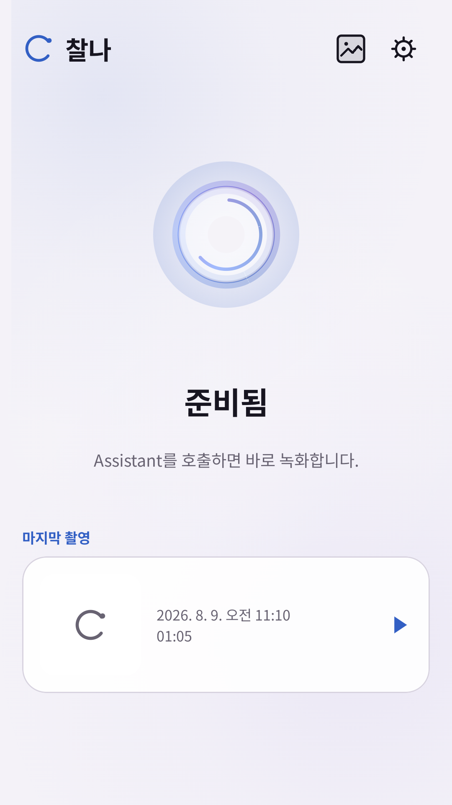
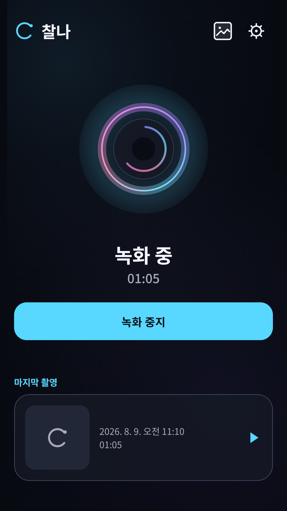
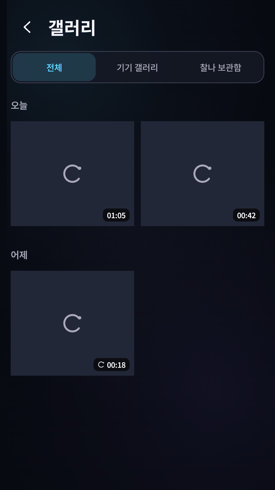
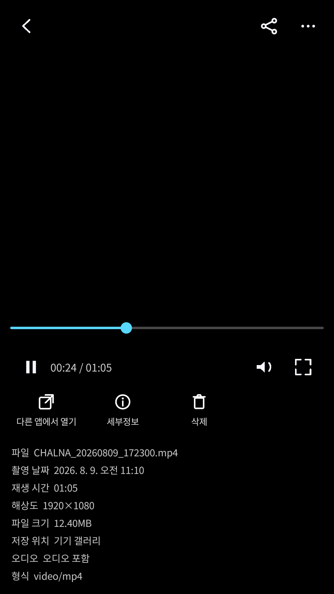
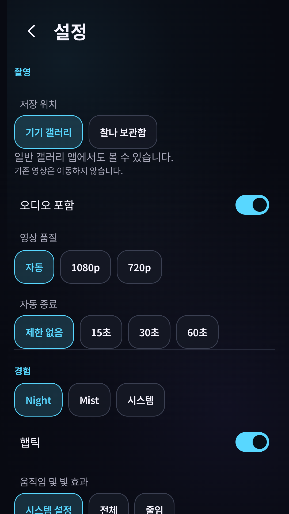
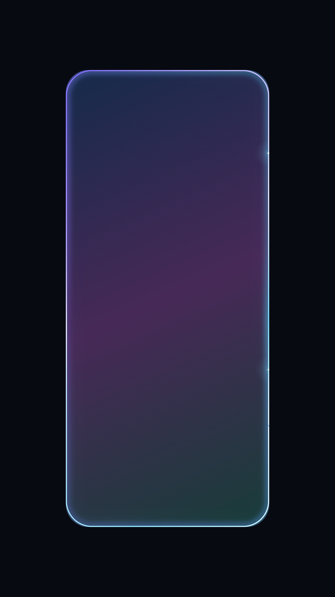

# Chalna

Chalna is a private Android 10+ application that turns an invocation of the user-selected system Assistant into an explicit toggle for local CameraX video recording. The first invocation starts capture; a later invocation or the recording notification stops it. Chalna never pre-captures, pre-buffers, warms the camera, binds it persistently, or activates camera/microphone before a user trigger. Version 1.1.0 adds local capture browsing and playback without adding network or broad media access.

## Status

Version 1.1.0 (`versionCode` 2) is the current signed update. Its private immutable Release contains the APK, checksum, and machine-readable build metadata. GitHub Actions is the build source of truth; physical Assistant-button, locked-screen OEM, camera-hardware latency, thermal, and high-refresh-rate results remain device-only checks documented in the [QA report](docs/QA_REPORT.md).

## Product contract

- Capture begins only after an Assistant invocation or recording-notification action. Test-only harnesses must never ship in production.
- Each recording uses the selected local destination: Device Gallery writes through Android MediaStore under `Movies/Chalna`; Chalna Vault uses app-private local storage. Vault does not claim encryption. Audio is optional and requires microphone permission.
- The Chalna library indexes only recordings created by Chalna. It does not scan the device gallery and does not request `READ_MEDIA_VIDEO`.
- Saved captures can be played in-app through AndroidX Media3. Playback accepts local content only; there is no streaming feature or network permission.
- The rear camera is used without a preview use case. Quality preference falls back across supported CameraX qualities.
- An ongoing foreground-service notification makes recording visible and provides a stop action.
- No account, cloud backend, analytics SDK, advertising SDK, or network permission.
- Assist structure, screen content, foreground-app identity, media content, contacts, location, and other unrelated data are not collected. Production builds contain no Diagnostics or VisualLab surface.

## Setup

1. Install a verified APK on Android 10 (API 29) or newer.
2. Open Chalna and grant Camera permission. Grant Microphone only if audio is enabled; grant Notifications where Android requests it.
3. Use Chalna's Assistant action to open the system role picker and select Chalna as the default digital assistant app.
4. Choose Device Gallery or Chalna Vault for future recordings.
5. Invoke the configured Assistant gesture to start recording. Confirm the visible recording state/notification.
6. Invoke again or use the notification Stop action to finalize the video, then use Chalna's local library to play or manage it.

Assistant selection, keyguard delivery, power-button gestures, and background-start behavior vary by Android release and OEM. Complete the [device test plan](docs/DEVICE_TEST_PLAN.md) before relying on a device.

## Build

The project pins AGP 9.3.1, Gradle 9.5.0, Kotlin 2.3.21, Compose BOM 2026.06.00, CameraX 1.6.1, Media3 1.11.0, and Java 17 bytecode. Media3 is limited to ExoPlayer; every playback control is implemented in Chalna's Foundation-only UI. Repository policy forbids local Android builds; GitHub Actions is the source of truth. Exact CI commands and evidence requirements are in [RELEASE.md](docs/RELEASE.md).

## Documentation

- [Product](docs/PRODUCT_SPEC.md) · [UX](docs/UX_SPEC.md) · [Architecture](docs/ARCHITECTURE.md)
- [Design system](docs/DESIGN_SYSTEM.md) · [Motion](docs/MOTION.md) · [Compatibility](docs/COMPATIBILITY.md)
- [Privacy](PRIVACY.md) · [Security](SECURITY.md) · [Third-party notices](THIRD_PARTY_NOTICES.md)

## v1.1.0 product screenshots

These are deterministic Korean Compose captures downloaded from [UI QA run 31322147867](https://github.com/sampple-korea/chalna-android/actions/runs/31322147867). The first rendered pass was inspected, deliberately refined, regenerated, and inspected again; no mockup tooling or fabricated product content was used.

| Ready · Mist | Recording · Night |
|---|---|
|  |  |

| Gallery · Night | Player details · Night |
|---|---|
|  |  |

| Settings · Night | Invocation glow on colorful content |
|---|---|
|  |  |

The adaptive icon's Galaxy-like squircle mask is also preserved as an inspected artifact: [icon mask preview](docs/screenshots/icon-mask-squircle.png).

## Authoritative references

- [VoiceInteractionService](https://developer.android.com/reference/android/service/voice/VoiceInteractionService)
- [CameraX video capture](https://developer.android.com/media/camera/camerax/video-capture)
- [Foreground-service types](https://developer.android.com/develop/background-work/services/fgs/service-types)
- [Runtime permissions](https://developer.android.com/training/permissions/requesting)
- [MediaStore](https://developer.android.com/training/data-storage/shared/media)
- [App-specific storage](https://developer.android.com/training/data-storage/app-specific)
- [AndroidX Media3](https://developer.android.com/jetpack/androidx/releases/media3)

Private and proprietary. No license to copy, redistribute, or publish is granted.
