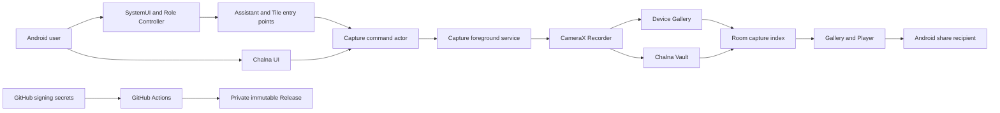

# Chalna threat model

## Executive summary

Chalna is a local-only Android camera utility whose highest-risk properties are the explicit-trigger privacy boundary, recorded-media integrity, and update-signing identity. The most important review surfaces are the system-bound Assistant and Quick Settings entry points, the serialized capture actor, process-death recovery, Room-to-file reconciliation, exported launcher intents, FileProvider grants, deletion/export transactions, and the release pipeline. The current controls make remote exfiltration implausible because the app has no network permission or network SDK; realistic residual risk comes from a malicious local app probing exported entry points, corrupted local state, OEM platform divergence, user-confirmed sharing, and compromise of the Android OS or signing environment.

## Scope and assumptions

- In scope: `app/src/main`, `app/src/debug`, `app/src/test`, `app/src/androidTest`, `benchmark`, `scripts`, Gradle configuration, and `.github/workflows`.
- Runtime context: a single-user Android application using system Assistant, Quick Settings, foreground-service, MediaStore, app-specific storage, Room, FileProvider, and local Media3 playback APIs.
- Data sensitivity: user-recorded video/audio, capture metadata, settings, playback position, the active-attempt journal, signing material in GitHub Secrets, and published installers.
- Internet exposure: none at runtime. The manifest declares no network permission and the dependency policy rejects analytics, advertising, and network stacks.
- Authorization expectation: the Android user explicitly grants camera/audio permissions and selects Chalna as Assistant; protected system bindings authenticate Assistant, recognition, and tile callers. Chalna has no account or multi-tenant model.
- The directive and repository metadata are authoritative context, so no separate service-context question remains. Physical OEM behavior and a rooted/compromised OS remain outside enforceable app guarantees.

Open questions that could change residual rankings:

- Whether a future distribution channel adds cloud backup or network features; either would create a new high-sensitivity trust boundary.
- Whether OEM builds deviate from documented Assistant, keyguard, foreground-service, or MediaStore behavior; the physical-device plan covers those variations.
- Whether a future storage mode promises encryption; the current Chalna Vault is app-specific storage, not encryption against a compromised OS.

## System model

### Primary components

- System entry points: `ChalnaVoiceInteractionService`, `ChalnaVoiceInteractionSessionService`, `ChalnaRecognitionService`, `AssistFallbackActivity`, `KeyguardCaptureActivity`, and `ChalnaCaptureTileService` (`app/src/main/AndroidManifest.xml`).
- Capture authority: `CaptureCommandDispatcher`, `CaptureCommandActor`, `CaptureStateRepository`, `CaptureService`, and `CameraXCaptureEngine` (`app/src/main/java/app/chalna/capture/capture`).
- Durable media state: `CaptureAttemptStore`, `ChalnaDatabase`, capture/pending/playback DAOs, `LegacyCaptureIndexImporter`, MediaStore, and Chalna Vault (`app/src/main/java/app/chalna/capture/data`, `app/src/main/java/app/chalna/capture/media`).
- User surfaces: `MainActivity`, Compose screens, `GalleryRepository`, `PlayerController`, notifications, and temporary share grants (`app/src/main/java/app/chalna/capture/ui`, `gallery`, `notifications`).
- Supply chain: pinned Gradle dependencies, dependency verification/locking, GitHub Actions, scoped signing secrets, immutable Releases, checksums, SBOM, and remote verification (`gradle`, `.github/workflows`, `scripts`).

### Data flows and trust boundaries

- Android Role Controller/SystemUI → Voice Interaction components: invocation flags and lifecycle callbacks cross Binder. The components require platform bind permissions; assist structure, screenshot, query, and foreground-app context are disabled or ignored. Manifest metadata identifies both session and recognition services.
- Assistant, Quick Tile, notification, or UI → capture dispatcher: an opaque invocation ID and typed command cross an in-process API or explicit non-exported service intent. IDs are normalized; the actor serializes commands; duplicate receipts and state transitions are authoritative.
- Capture actor → CameraX foreground service: requested destination, audio, quality, and auto-stop snapshot cross the internal command boundary. Runtime permissions, current storage, foreground-service policy, and state are checked before camera binding. Camera/microphone activation happens only after an explicit trigger.
- CameraX → MediaStore or Chalna Vault: encoded MP4 bytes and metadata cross Android storage APIs. The attempt journal records exact output identity first; final output is validated before READY indexing; valid media is preserved if metadata persistence fails.
- Room capture ID → Gallery/Player: only records created or migrated by Chalna produce local content references. IDs use an opaque accepted format; repository lookup and storage validation precede playback, share, export, restore, or deletion.
- Chalna Vault → external recipient: a user-initiated chooser receives exact `content://` URIs in `ClipData` with temporary read grants. FileProvider is non-exported and exposes only the Vault subtree.
- GitHub Secrets → Actions runner → signed APK/AAB → private immutable Release: step-scoped secrets reconstruct the keystore temporarily. The workflow pins the previous signer, verifies package/version/permissions/signature/alignment, publishes complete assets once, downloads them again, and compares digests.

#### Diagram

## Assets and security objectives

| Asset | Why it matters | Security objective (C/I/A) |
|---|---|---|
| Recorded video/audio | Private user content; loss or unauthorized disclosure causes direct harm | C/I/A |
| Explicit-trigger invariant | Prevents hidden, pre-trigger, or surprise recording | I/A |
| Capture state and command order | Determines whether exactly one recorder starts/stops/finalizes | I/A |
| Attempt journal and Room index | Enables recovery without deleting valid media or showing false items | I/A |
| Vault paths and URI grants | Bounds what local files another app can read | C/I |
| Settings and Assistant role state | Controls audio, storage, readiness, and invocation behavior | I/A |
| Signing key and certificate identity | Authorizes compatible updates | C/I/A |
| APK/AAB, checksums, SBOM, provenance | Lets operators detect tampering or substitution | I/A |
| Local bounded telemetry | Supports debugging without containing media or screen content | C/I |

## Attacker model

### Capabilities

- Install and run an ordinary third-party Android app under a separate UID.
- Send intents to exported components, probe malformed actions/extras, race user-visible operations, and attempt stale PendingIntent or URI use.
- Supply malformed/corrupted local database, legacy-index, media-metadata, or process-recovery state if the device storage is damaged or the app is restored from an inconsistent backup.
- Observe public APK/AAB structure and reverse engineer client code.
- Trick a user into choosing a share recipient or deleting media, without bypassing Android confirmation itself.
- Attack CI dependencies, workflow configuration, or release assets if repository credentials or the Actions environment are compromised.

### Non-capabilities

- No assumed root, system UID, unlocked bootloader, Android framework compromise, or access to another app's private data.
- No runtime network request surface, account credential, server, multi-tenant API, or remote command channel exists.
- No initial access to GitHub Secrets, the private release keystore, or the authenticated repository owner account.
- No ability to bypass system camera/microphone privacy indicators, permission sheets, lockscreen authentication, or FileProvider grants through Chalna code alone.

## Entry points and attack surfaces

| Surface | How reached | Trust boundary | Notes | Evidence (repo path / symbol) |
|---|---|---|---|---|
| Launcher activity | Explicit/launcher intent | Other UID → exported Activity | Only launcher and internal open-capture action are recognized; capture ID is opaque and resolved through Room | `app/src/main/java/app/chalna/capture/MainActivity.kt`; `ProductionUiDependencies.openCaptureWhenReady` |
| Assistant service/session | Android role invocation | System UID → protected Binder service | Requires `BIND_VOICE_INTERACTION`; recognition service and session metadata are complete | `app/src/main/AndroidManifest.xml`; `res/xml/voice_interaction_service.xml` |
| Assistant fallback activity | `ACTION_ASSIST` | System UID → protected exported Activity | Requires `BIND_VOICE_INTERACTION`; generates internal invocation ID | `AssistFallbackActivity`; manifest permission |
| Recognition service | Speech service binding | System UID → protected service | Required for role qualification; Chalna does not retain speech/query data | `ChalnaRecognitionService`; `recognition_service.xml` |
| Quick Settings tile | User tile click | SystemUI → protected TileService | Requires `BIND_QUICK_SETTINGS_TILE`; locked clicks use `unlockAndRun` | `ChalnaCaptureTileService` |
| Notification actions | User taps immutable PendingIntent | System notification → app | Unique immutable requests; stale STOP is a no-op/cleanup path | `CaptureNotifications`; `CaptureService` |
| Capture service | Explicit internal service intent | App components → non-exported FGS | Typed action and invocation ID; actor serializes all state changes | `CaptureService`; `CaptureCommandActor` |
| MediaStore/Vault files | CameraX output and repository actions | App UID → Android storage | Exact output identity journaled and validated; no whole-library read permission | `CaptureDestinations`; `CameraXCaptureEngine`; `CaptureAttemptStore` |
| Room/legacy importer | App startup or Gallery lazy initialization | Local file → typed database rows | Transactional, idempotent import with malformed-row isolation | `ChalnaDatabase`; `LegacyCaptureIndexImporter` |
| FileProvider/share | User chooser action | App UID → selected recipient UID | Narrow path, exact ClipData URIs, temporary read grant, no raw path | `res/xml/file_paths.xml`; `ProductionUiDependencies.share` |
| Player/deep navigation | Internal capture ID | Notification/exported Activity → Room | Arbitrary URIs and paths are not accepted; missing records fail closed | `MainActivity.handleIntent`; `GalleryRepository.byId`; `PlayerController` |
| Release workflow | Manual dispatch on main | GitHub operator → Actions runner | Version/tag/signer checks, scoped secrets, pinned actions, immutable publish | `.github/workflows/release.yml` |

## Top abuse paths

1. A local app sends the internal open-capture action with malformed/guessed identifiers → opaque-ID validation and Room lookup reject it → no arbitrary URI or private path reaches the player.
2. A duplicated Assistant callback races the session and prepare callbacks → invocation registry and actor receipt dedupe collapse it → at most one recorder begins.
3. A user invokes again during camera startup → the actor transitions to cancel or immediate safe finalize → no hidden background recorder remains.
4. A process dies after media bytes are valid but before Room persistence → exact attempt journal points to the output → recovery validates and salvages the clip instead of deleting it.
5. Corrupt legacy index rows attempt to poison migration → bounded decoder skips individual malformed rows and imports usable unique records transactionally → migration remains repeatable.
6. A selected Vault item is shared → repository resolves the exact Chalna record and FileProvider URI → chooser grants only that media, not a directory or raw path.
7. A stale notification STOP is triggered after service termination → service/controller sees no active capture → notification is removed without starting camera FGS.
8. A malicious dependency or workflow change attempts signer substitution → dependency policy, CodeQL/secret checks, pinned actions, previous-fingerprint gate, and remote artifact verification block publication.

## Threat model table

| Threat ID | Threat source | Prerequisites | Threat action | Impact | Impacted assets | Existing controls (evidence) | Gaps | Recommended mitigations | Detection ideas | Likelihood | Impact severity | Priority |
|---|---|---|---|---|---|---|---|---|---|---|---|---|
| TM-001 | Malicious local app | Ordinary installed app can address exported launcher Activity | Inject action/extras to open an arbitrary URI or crash UI | Unauthorized media display or denial of service | Media confidentiality, UI availability | Action allowlist plus opaque-ID/Room lookup (`MainActivity.handleIntent`, `openCaptureWhenReady`) | Activity must remain exported for launcher | Keep accepting only IDs; retain malformed/unknown-ID instrumentation tests | Count sanitized rejected action/ID outcomes in debug tests only | low | high | medium |
| TM-002 | Duplicate/racing system callbacks | Rapid invocation, OEM duplicate callback, or multiple triggers | Start two recorders or lose a stop/cancel | Hidden recording, corruption, resource leak | Trigger invariant, state, media integrity | Single-consumer actor and invocation receipts (`CaptureCommandActor`, `CaptureStateRepository`, `AssistantInvocationRegistry`) | OEM callback ordering varies | Maintain 100-event concurrency stress and physical OEM validation | Bounded local outcome codes; active-recorder invariant tests | medium | high | high |
| TM-003 | Process death/storage corruption | Kill or crash during start, recording, finalize, or DB persist | Leave usable clip orphaned or delete valid partial output | User video loss | Media availability/integrity | Exact attempt journal, validation, salvage, `START_NOT_STICKY` (`CaptureAttemptStore`, `CaptureRecovery`) | OEM/CameraX behavior after hard kill varies | Preserve recovery fixtures and physical kill tests; never delete parseable output solely for missing DB row | Recovery outcome counts without paths/URIs | medium | high | high |
| TM-004 | Malformed legacy/database state | Old AtomicFile is truncated, duplicated, or corrupt | Poison migration or cause destructive fallback | Missing Gallery index, startup failure | Index and media availability | Transactional idempotent importer, unique schema, no destructive migration (`LegacyCaptureIndexImporter`, `ChalnaDatabase`) | Files remain independently mutable | Continue schema export/migration fixtures and bounded reconciliation | Empty/large/mixed/truncated/unknown-value/idempotency fixtures plus import/skip counts | medium | medium | medium |
| TM-005 | FileProvider/share abuse | User selects share or another app probes provider URI | Traverse path or retain broader grant | Vault media disclosure | Media confidentiality | Non-exported provider, narrow Vault path, canonical repository lookup, ClipData read grant (`file_paths.xml`, `shareUris`) | Recipient may retain shared bytes legitimately | Keep path traversal tests; never widen provider root; show Android chooser | Security instrumentation for `../`, foreign authority, trash paths | low | high | medium |
| TM-006 | Deletion/export race | Batch operation partially fails or exported copy disappears | Report success incorrectly, lose original, or create duplicates | User video loss/confusion | Media availability/integrity | Trash-first semantics, per-item results, transactional relationships, idempotent export (`GalleryRepository`) | MediaStore can be modified externally | Preserve original on export; reconcile relation lazily; expose partial failure | Batch success/failure counts without names/URIs | medium | high | high |
| TM-007 | Locked-device tile misuse | Attacker has physical access to locked device and tile is present | Trigger recording without user authentication | Privacy violation | Trigger invariant, media confidentiality | Platform-protected TileService and `unlockAndRun` (`ChalnaCaptureTileService`) | OEM lockscreen tile behavior varies | Physical locked-device matrix; do not add keyguard bypass or private OEM intents | Manual OEM test record | low | high | medium |
| TM-008 | Assist-context exposure | Platform invokes assist callbacks with foreground content | Persist/log screenshot, query, package, or AssistStructure | Disclosure of another app's content | User privacy | Disabled/ignored context and no persistence/logging (`ChalnaVoiceInteractionSession`, static policy) | Framework may still invoke callbacks | Keep callbacks no-op and source assertions; never add assist-context telemetry | CI grep/static tests | low | high | medium |
| TM-009 | Signing/workflow compromise | Repository write or Actions secret compromise | Publish update with alternate signer or tampered asset | Supply-chain compromise | Signing identity, installers | Step-scoped secrets, prior-fingerprint pin, pinned actions, checksums/SBOM, immutable Release, re-download verification (`release.yml`) | GitHub account takeover remains external | Enforce MFA/ruleset; rotate credentials on incident; preserve signer backup offline | GitHub audit log, immutable verification, fingerprint comparison | low | high | high |
| TM-010 | Dependency adds runtime network/material/debug surface | Dependency/workflow change reaches release graph | Exfiltrate media or ship debug component | Privacy breach or attack surface expansion | Media confidentiality, release integrity | No network permission; forbidden dependency/manifest/DEX policy; SBOM (`check-policy`, release validation) | Transitive graphs change over time | Keep releaseRuntime graph gate, dependency review, CodeQL and Visual Lab absence checks | CI policy failures and SBOM diff | low | high | medium |

## Criticality calibration

- **Critical:** a pre-trigger camera/microphone path reachable without explicit user action; release signing-key theft enabling a trusted malicious update; broad arbitrary-file disclosure from Vault without user choice.
- **High:** deterministic loss of valid recorded video during recovery; a race allowing multiple/hidden recorders; signer substitution caught only after publication.
- **Medium:** malformed local input causing recoverable Gallery denial of service; a stale index or external deletion producing temporary UI inconsistency; excessive but user-initiated URI grant scope.
- **Low:** sanitized local diagnostic mismatch with no media exposure; debug-only visual issue; noisy attack requiring root/system compromise already outside Chalna's boundary.

Ratings assume a normal non-rooted consumer Android device, no runtime network permission, Android's UID sandbox, and protected system bindings. Adding network access, cloud storage, exported media-provider APIs, or unprotected capture components would materially raise several risks.

## Focus paths for security review

| Path | Why it matters | Related Threat IDs |
|---|---|---|
| `app/src/main/AndroidManifest.xml` | Defines permissions, exported components, system bind permissions, provider, FGS, and tile boundaries | TM-001, TM-005, TM-007, TM-008, TM-010 |
| `app/src/main/res/xml/file_paths.xml` | Determines the maximum Vault subtree available for temporary grants | TM-005 |
| `app/src/main/res/xml/voice_interaction_service.xml` | Controls Assistant role qualification and session/recognizer binding | TM-002, TM-008 |
| `app/src/main/java/app/chalna/capture/MainActivity.kt` | Exported launcher input handling and internal player navigation | TM-001 |
| `app/src/main/java/app/chalna/capture/assistant` | Invocation dedupe, context minimization, session cleanup, and keyguard routing | TM-002, TM-008 |
| `app/src/main/java/app/chalna/capture/capture/CaptureCommandActor.kt` | Atomic toggle conversion, cancellation, state ordering, and side-effect serialization | TM-002, TM-003 |
| `app/src/main/java/app/chalna/capture/capture/CaptureService.kt` | Foreground-service lifecycle, stale actions, permissions, notification, thermal, and cleanup | TM-002, TM-003, TM-007 |
| `app/src/main/java/app/chalna/capture/capture/CameraXCaptureEngine.kt` | Camera/microphone activation, output identity, finalize validation, and resource release | TM-002, TM-003 |
| `app/src/main/java/app/chalna/capture/capture/CaptureAttemptStore.kt` | Durable exact-attempt identity and crash-safe journal parsing | TM-003 |
| `app/src/main/java/app/chalna/capture/data` | Room schema, migrations, unique IDs, pending operations, and playback state | TM-003, TM-004, TM-006 |
| `app/src/main/java/app/chalna/capture/gallery/GalleryRepository.kt` | File/index reconciliation, trash, export, share, and partial batch semantics | TM-004, TM-005, TM-006 |
| `app/src/main/java/app/chalna/capture/media` | Canonical storage containment, MediaStore ownership, and Vault output handling | TM-003, TM-005, TM-006 |
| `app/src/main/java/app/chalna/capture/notifications/CaptureNotifications.kt` | Immutable PendingIntent identities and exact capture navigation | TM-001, TM-002 |
| `app/src/main/java/app/chalna/capture/ui/PlayerController.kt` | Local-only source lifecycle and recording conflict handling | TM-001, TM-003 |
| `scripts/check-policy.ps1` | Source/manifest/dependency constraints for privacy and debug exclusion | TM-010 |
| `.github/workflows/security.yml` | CodeQL, workflow, credential, dependency, and SBOM verification | TM-009, TM-010 |
| `.github/workflows/release.yml` | Signing continuity, artifact validation, immutable publication, and remote verification | TM-009, TM-010 |

## Quality check

- Covered launcher, Assistant, recognition, fallback, keyguard, Quick Tile, notification, capture service, storage, Room migration, Gallery, Player, FileProvider/share, and release entry points.
- Represented every runtime and supply-chain trust boundary in at least one threat.
- Separated production runtime from debug Visual Lab, CI/build tooling, and tests.
- Used the directive's explicit local-only, single-user, no-network, private-repository, same-signer context rather than inventing server or account threats.
- Marked physical OEM behavior, rooted devices, and possible future network/storage changes as residual assumptions rather than verified controls.
